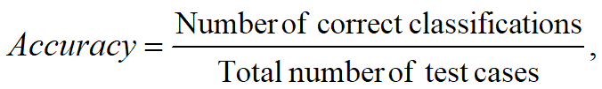
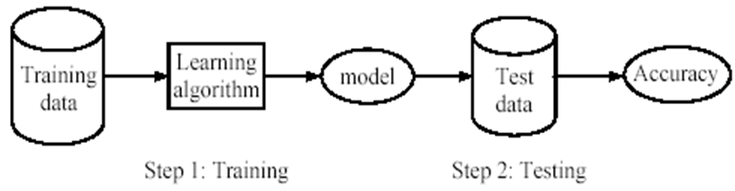
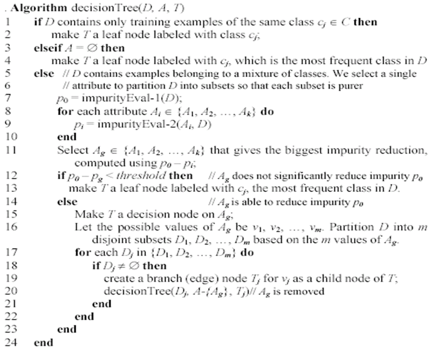
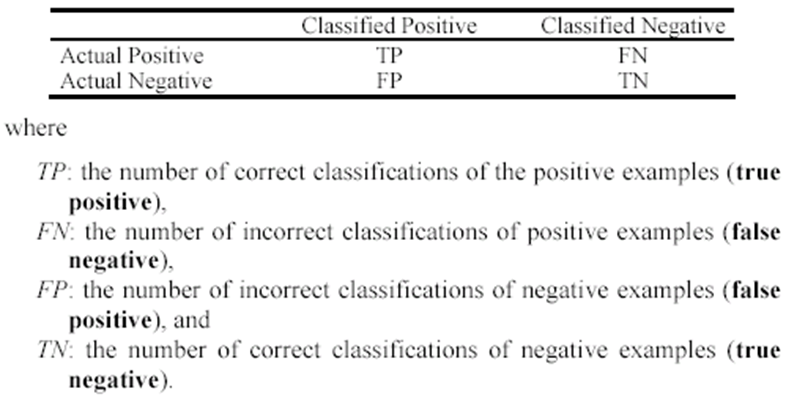
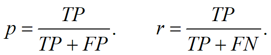
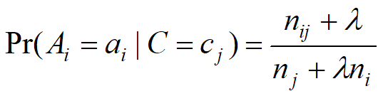

<html>
	<head>
		<meta
			content="text/html; charset=UTF-8"
			http-equiv="content-type"
		/>
	</head>
	<body class="c27">
		
ML Notes: CAT 2

		

		

			Data:&nbsp;A set of data records (also called examples, instances
				or cases) described by
			
		

		<ul class="c9 lst-kix_3p9h98ototk5-0 start">
			<li class="c0 li-bullet-0">
				k attributes: A1, A2, &hellip; Ak. &nbsp;
			</li>
			<li class="c0 li-bullet-0">
				a class: Each example is labelled with a pre-defined class.
				
			</li>
		</ul>
		

			Goal:&nbsp;To learn a classification model from the data that can
				be used to predict the classes of new (future, or test)
				cases/instances.
		

		

		

			Supervised vs Unsupervised Learning
		

		

			Supervised learning: classification is seen as supervised learning from examples.
			
		

		<ul class="c9 lst-kix_zanm8c1imzcr-0 start">
			<li class="c0 li-bullet-0">
				Supervision: The data (observations, measurements, etc.)
					are labeled with predefined classes. It is like that a
					&ldquo;teacher&rdquo; gives the classes (supervision).
					&nbsp;
			</li>
			<li class="c0 li-bullet-0">
				Test data are classified into these classes too.
				
			</li>
		</ul>
		

			Unsupervised learning: clustering
		

		<ul class="c9 lst-kix_3h492yam9vfd-0 start">
			<li class="c0 li-bullet-0">
				Class labels of the data are unknown
			</li>
			<li class="c0 li-bullet-0">
				Given a set of data, the task is to establish the existence
					of classes or clusters in the data
			</li>
		</ul>
		

		

			Supervised learning process: two steps
		

		<ol class="c9 lst-kix_69jqfbbojq1l-0 start" start="1">
			<li class="c0 li-bullet-0">
				Learning (training): Learn a model using the training
					data
			</li>
		</ol>
		<ul class="c9 lst-kix_v5cm4gbeq60u-0 start">
			<li class="c3 c16 li-bullet-0">
				Given a data set D, a task T, and a performance measure M,
					a computer system is said to learn from D to perform the task T if after learning the
					system&rsquo;s performance on T improves as measured by
					M
			</li>
			<li class="c3 c16 li-bullet-0">
				In other words, the learned model helps the system to perform T better as compared to no learning. 
			</li>
		</ul>
		<ol class="c9 lst-kix_69jqfbbojq1l-0" start="2">
			<li class="c0 li-bullet-0">
				Testing: Test the model using unseen test data to assess
					the model accuracy
			</li>
		</ol>
		

			
		

		

		

			Fundamental Assumption of Learning
		

		

			The distribution of training examples is identical to the
				distribution of test examples (including future unseen
				examples).
			
		

		<ul class="c9 lst-kix_5e2dulrpasdu-0 start">
			<li class="c0 li-bullet-0">
				In practice, this assumption is often violated to a certain
					degree.
				
			</li>
			<li class="c0 li-bullet-0">
				Strong violations will clearly result in poor
					classification accuracy.
				
			</li>
			<li class="c0 li-bullet-0">
				To achieve good accuracy on the test data, training
					examples must be sufficiently representative of the test
					data.
				
			</li>
		</ul>
		

		
Decision Tree

		

		
Algorithms

		

		<a id="t.86d77b78d54b4e0fdcfa9f27cf735956f3d8e455"></a
		>
		<table class="c21">
			<tbody>
				<tr class="c7">
					<td class="c23" colspan="1" rowspan="1">
						

							Greedy: Divide and Conquer
						

						<ul class="c9 lst-kix_gapx7fw5v83h-0 start">
							<li class="c0 li-bullet-0">
								Assume attributes are categorical now (continuous
									attributes can be handled too)
							</li>
							<li class="c0 li-bullet-0">
								Tree is constructed in a top-down recursive
									manner
							</li>
							<li class="c0 li-bullet-0">
								At start, all the training examples are at the
									root
							</li>
							<li class="c0 li-bullet-0">
								Examples are partitioned recursively based on
									selected attributes
							</li>
							<li class="c0 li-bullet-0">
								Attributes are selected on the basis of an impurity
									function (e.g., information gain)
							</li>
						</ul>
						

							Conditions for stopping Partitioning
						

						<ul class="c9 lst-kix_9nkukcdi3cby-0 start">
							<li class="c0 li-bullet-0">
								All examples for a given node belong to the same
									class
							</li>
							<li class="c0 li-bullet-0">
								There are no remaining attributes for further
									partitioning &ndash; majority class is the
									leaf
							</li>
							<li class="c0 li-bullet-0">
								There are no examples left
							</li>
						</ul>
						

					</td>
				</tr>
			</tbody>
		</table>
		

		

			
		

		

		

			How to choose a root to partition data in a decision
				tree?
		

		<ul class="c9 lst-kix_hy69ojzb320r-0 start">
			<li class="c0 li-bullet-0">
				The key to building a decision tree - which attribute to
					choose in order to branch.
				
			</li>
			<li class="c0 li-bullet-0">
				The objective is to reduce impurity or uncertainty in data
					as much as possible.
			</li>
		</ul>
		<ul class="c9 lst-kix_hy69ojzb320r-1 start">
			<li class="c3 c4 li-bullet-0">
				A subset of data is pure if all instances belong to the
					same class.
				
			</li>
		</ul>
		<ul class="c9 lst-kix_hy69ojzb320r-0">
			<li class="c0 li-bullet-0">
				The heuristic in C4.5 is to choose the attribute with the
					maximum Information Gain or Gain Ratio based on information theory.
			</li>
		</ul>
		

		

			Information Theory: provides a mathematical basis for measuring the information
				content
		

		

		

			Entropy: We use entropy as a measure of impurity or disorder of data
				set D. (Or, a measure of information in a tree)
		

		

		

			Issues in Decision Tree Learning
		

		<ol class="c9 lst-kix_lbd0q5hrfye0-0 start" start="1">
			<li class="c0 li-bullet-0">
				Avoid overfitting in classification Overfitting: &nbsp;A tree may overfit the training data
				
			</li>
		</ol>
		<ul class="c9 lst-kix_lbd0q5hrfye0-1 start">
			<li class="c3 c4 li-bullet-0">
				Good accuracy on training data but poor on test data
			</li>
			<li class="c3 c4 li-bullet-0">
				Symptoms: tree too deep and too many branches, some may
					reflect anomalies due to noise or outliers
			</li>
		</ul>
		

			How to avoid overfitting?
		

		

			Two approaches to avoid overfitting: pre-pruning and
				post-pruning
		

		<ol class="c9 lst-kix_f1u9odc868e6-0 start" start="1">
			<li class="c3 c4 li-bullet-0">
				Pre-pruning: Halt tree construction early
			</li>
		</ol>
		<ul class="c9 lst-kix_5tgsma6dk7af-0 start">
			<li class="c1 li-bullet-0">
				Difficult to decide because we do not know what may happen
					subsequently if we keep growing the tree.
				
			</li>
		</ul>
		<ol class="c9 lst-kix_f1u9odc868e6-0" start="2">
			<li class="c3 c4 li-bullet-0">
				Post-pruning: Remove branches or sub-trees from a &ldquo;fully
					grown&rdquo; tree.
			</li>
		</ol>
		<ul class="c9 lst-kix_pgk9kyyrpe1-0 start">
			<li class="c1 li-bullet-0">
				This method is commonly used. C4.5 uses a statistical
					method to estimate the errors at each node for pruning.
				
			</li>
			<li class="c1 li-bullet-0">
				A validation set may be used for pruning as well.
			</li>
		</ul>
		<ol class="c9 lst-kix_lbd0q5hrfye0-0" start="2">
			<li class="c0 li-bullet-0">
				From tree to rules, and rule pruning
			</li>
			<li class="c0 li-bullet-0">
				Handling of miss values
			</li>
			<li class="c0 li-bullet-0">
				Handing skewed distributions
			</li>
			<li class="c0 li-bullet-0">
				Handling attributes and classes with different costs.
				
			</li>
			<li class="c0 li-bullet-0">
				Attribute construction
			</li>
		</ol>
		

		

			Evaluating classification methods
		

		
Terms

		<ul class="c9 lst-kix_w0pdl0fe16gj-0 start">
			<li class="c0 li-bullet-0">
				Predictive accuracy
			</li>
		</ul>
		

		<ul class="c9 lst-kix_plpptt1l1ldx-0 start">
			<li class="c0 li-bullet-0">
				Efficiency
			</li>
		</ul>
		<ul class="c9 lst-kix_plpptt1l1ldx-1 start">
			<li class="c1 li-bullet-0">
				time to construct the model
			</li>
			<li class="c1 li-bullet-0">
				time to use the model
			</li>
		</ul>
		<ul class="c9 lst-kix_plpptt1l1ldx-0">
			<li class="c0 li-bullet-0">
				Robustness: handling noise and missing values
			</li>
			<li class="c0 li-bullet-0">
				Scalability: efficiency in disk-resident databases
				
			</li>
			<li class="c0 li-bullet-0">
				Interpretability: understandable insight provided by the
					model
			</li>
			<li class="c0 li-bullet-0">
				Compactness of the model: size of the tree, or the number
					of rules.
				
			</li>
		</ul>
		

		
Evaluation Methods

		<ul class="c9 lst-kix_djgmjujhpanv-0 start">
			<li class="c0 li-bullet-0">
				Holdout set:&nbsp;The available data set D is divided into two disjoint
					subsets, the training set Dtrain&nbsp;(for learning a model) the test set Dtest&nbsp;(for testing the model).
			</li>
		</ul>
		<ul class="c9 lst-kix_djgmjujhpanv-1 start">
			<li class="c3 c4 li-bullet-0">
				Important: training set should not be used in testing and
					the test set should not be used in learning since an unseen
					test set provides an unbiased estimate of accuracy.
				
			</li>
			<li class="c3 c4 li-bullet-0">
				The test set is also called the holdout set. (the examples
					in the original data set D are all labeled with classes.)
				
			</li>
			<li class="c3 c4 li-bullet-0">
				This method is mainly used when the data set D is large.
				
			</li>
		</ul>
		<ul class="c9 lst-kix_djgmjujhpanv-0">
			<li class="c0 li-bullet-0">
				n-fold cross-validation: The available data is partitioned into n equal-size
					disjoint subsets.
				
			</li>
		</ul>
		<ul class="c9 lst-kix_djgmjujhpanv-1 start">
			<li class="c3 c4 li-bullet-0">
				Use each subset as the test set and combine the rest n-1
					subsets as the training set to learn a classifier
			</li>
			<li class="c3 c4 li-bullet-0">
				The procedure is run n times, which give n accuracies.
				
			</li>
			<li class="c3 c4 li-bullet-0">
				The final estimated accuracy of learning is the average of
					the n accuracies.
				
			</li>
			<li class="c3 c4 li-bullet-0">
				10-fold and 5-fold cross-validations are commonly used.
					&nbsp;
			</li>
			<li class="c3 c4 li-bullet-0">
				This method is used when the available data is not large.
				
			</li>
		</ul>
		<ul class="c9 lst-kix_djgmjujhpanv-0">
			<li class="c0 li-bullet-0">
				Leave-one-out cross-validation: This method is used when the data set is very small.
				
			</li>
		</ul>
		<ul class="c9 lst-kix_djgmjujhpanv-1 start">
			<li class="c3 c4 li-bullet-0">
				It is a special case of cross-validation
			</li>
			<li class="c3 c4 li-bullet-0">
				Each fold of the cross validation has only a single test
					example and all the rest of the data is used in training.
				
			</li>
			<li class="c3 c4 li-bullet-0">
				If the original data has m examples, this is m-fold
					cross-validation
				
			</li>
		</ul>
		<ul class="c9 lst-kix_djgmjujhpanv-0">
			<li class="c0 li-bullet-0">
				Validation set: the available data is divided into three subsets, a
					training set, a validation set and a test set.
				
			</li>
		</ul>
		<ul class="c9 lst-kix_djgmjujhpanv-1 start">
			<li class="c3 c4 li-bullet-0">
				A validation set is used frequently for estimating
					parameters in learning algorithms.
				
			</li>
			<li class="c3 c4 li-bullet-0">
				In such cases, the values that give the best accuracy on
					the validation set are used as the final parameter values.
				
			</li>
			<li class="c3 c4 li-bullet-0">
				Cross-validation can be used for parameter estimating as
					well.
				
			</li>
		</ul>
		

		
Classification measures

		<ul class="c9 lst-kix_ufdg6u79jg9c-0 start">
			<li class="c3 c16 li-bullet-0">
				In classification involving skewed or highly imbalanced
					data, e.g., network intrusion and financial fraud
					detections, we are interested only in the minority class.
				
			</li>
		</ul>
		<ul class="c9 lst-kix_ufdg6u79jg9c-1 start">
			<li class="c1 li-bullet-0">
				High accuracy does not mean any intrusion is detected.
				
			</li>
			<li class="c1 li-bullet-0">
				E.g., 1% intrusion. Achieve 99% accuracy by doing nothing.
				
			</li>
		</ul>
		<ul class="c9 lst-kix_ufdg6u79jg9c-0">
			<li class="c3 c16 li-bullet-0">
				The class of interest is commonly called the positive
					class, and the rest negative classes.
			</li>
		</ul>
		

			Precision and Recall measures
		

		

			
		

		

			
		

		

		<ol class="c9 lst-kix_n241nr3b65kb-0 start" start="1">
			<li class="c0 li-bullet-0">
				Precision p&nbsp;is the number of correctly classified positive
					examples divided by the total number of examples that are
					classified as positive.
				
			</li>
			<li class="c0 li-bullet-0">
				Recall r&nbsp;is the number of correctly classified positive
					examples divided by the total number of actual positive
					examples in the test set.
				
			</li>
		</ol>
		

		

			F1-value (also called F1-score): harmonic mean of p and r )
		

		<ul class="c9 lst-kix_3ap67mc1e5mx-0 start">
			<li class="c0 li-bullet-0">
				The harmonic mean of two numbers tends to be closer to the
					smaller of the two.
				
			</li>
			<li class="c0 li-bullet-0">
				For F1-value to be large, both p and r must be large.
				
			</li>
		</ul>
		

		

			ROC (Receive operating characteristics ) Curve: It is a plot of the true positive rate (TPR) against the
				false positive rate (FPR).
		

		

			True Positive Rate: &nbsp;False Positive Rate: 
		

		

		

			Sensitivity and Specificity: 
		

		<ul class="c9 lst-kix_zguewh3b03zr-0 start">
			<li class="c0 li-bullet-0">
				Sensitivity: Same as TPR
			</li>
			<li class="c0 li-bullet-0">
				Specificity: Also called True Negative Rate: 
			</li>
			<li class="c0 li-bullet-0">
				FPR = 1 - specificity
			</li>
		</ul>
		

		

			Naive Bayes Classification
		

		

			A machine learning algorithm - classification technique. Naive Bayes is used when the output variable is discrete.
			
		

		<ul class="c9 lst-kix_tfj6dtlc5p0g-0 start">
			<li class="c0 li-bullet-0">
				Conditional probability: a measure of the probability of event A occurring given
					that another event has occurred. For example, &ldquo;what is
					the probability that it will rain given that it is
					cloudy?&rdquo; is an example of conditional
					probability.
			</li>
			<li class="c0 li-bullet-0">
				Joint Probability: a measure that calculates the likelihood of two or more
					events occurring at the same time.
			</li>
			<li class="c0 li-bullet-0">
				Proportionality: refers to the relationship between two quantities that
					are multiplicatively connected to a constant, or in simpler
					terms, whether their ratio yields a constant.
			</li>
			<li class="c0 li-bullet-0">
				Bayes Theorem: according to Wikipedia, Bayes&rsquo; Theorem describes
					the probability of an event (posterior) based on the prior
					knowledge of conditions that might be related to the
					event.
			</li>
		</ul>
		

		<a id="t.eea1f2efd189d2e4f15b07d4116b9568e355b727"></a
		>
		<table class="c21">
			<tbody>
				<tr class="c7">
					<td class="c23" colspan="1" rowspan="1">
						

							Steps (Algorithm):
						

						<ol class="c9 lst-kix_k9us6aws6d5m-0 start" start="1">
							<li class="c3 c16 li-bullet-0">
								Step 1: &nbsp;Frequency Table
							</li>
						</ol>
						

							First, we need to convert the data into a frequency
								table, so that we can get the values of P(X|y) and
								P(X). Recall that we are solving for P(y|X):
						

						<ol class="c9 lst-kix_k9us6aws6d5m-0" start="2">
							<li class="c3 c16 li-bullet-0">
								Step 2: Frequencies into ratios or conditional
									probabilities
								
							</li>
						</ol>
						

							we want to convert the frequencies into ratios or
								conditional probabilities:
						

						<ol class="c9 lst-kix_k9us6aws6d5m-0" start="3">
							<li class="c3 c16 li-bullet-0">
								Step 3: Proportionality equation to predict y,
									given X
							</li>
						</ol>
						

							Finally, we can use the proportionality equation to
								predict y, given X.
						

					</td>
				</tr>
			</tbody>
		</table>
		

		

			Naive Bayes&rsquo; Applications
		

		<ul class="c9 lst-kix_n9y92x7wayic-0 start">
			<li class="c0 li-bullet-0">
				Real-time prediction:&nbsp;Because Naive Bayes is fast and it&rsquo;s based on
					Bayesian statistics, it works well at making predictions in
					real-time. In fact, a lot of popular real-time models or
					online models are based on Bayesian statistics.
			</li>
			<li class="c0 li-bullet-0">
				Multiclass prediction:&nbsp;As previously stated, Naive Bayes works well when
					there are more than two classes for the output
					variable.
			</li>
			<li class="c0 li-bullet-0">
				Text classification:&nbsp;Text classification also includes sub-applications
					like spam filtering and sentiment analysis. Since Naive
					Bayes works best with discrete variables, it tends to work
					well in these applications.
			</li>
			<li class="c0 li-bullet-0">
				Recommendation systems:&nbsp;Naive Bayes is commonly used alongside other
					algorithms like Collaborative Filtering to build
					recommendations systems like Netflix&rsquo;s recommended for
					you section, or Amazon&rsquo;s recommended products, or
					Spotify&rsquo;s recommended songs.
			</li>
		</ul>
		

		
Issues with Naive Bayes

		<ul class="c9 lst-kix_qdtk9h1qk5nf-0 start">
			<li class="c0 li-bullet-0">
				Numeric attributes:&nbsp;Na&iuml;ve Bayesian learning assumes that all
					attributes are categorical. Numeric attributes need to be
					discretized.
			</li>
			<li class="c0 li-bullet-0">
				Zero counts: An particular attribute value never occurs together with
					a class in the training set. We need smoothing.
			</li>
		</ul>
		

			
		

		<ul class="c9 lst-kix_qdtk9h1qk5nf-0">
			<li class="c0 li-bullet-0">
				Missing values:&nbsp;Missing values are Ignored 
			</li>
		</ul>
		

		

			Advantages and Disadvantages of Naive Bayes
		

		<a id="t.23026b7eafcbddfe7831d42deb7836ce9ee43cf3"></a
		>
		<table class="c21">
			<tbody>
				<tr class="c7">
					<td class="c18" colspan="1" rowspan="1">
						
Advantages

					</td>
					<td class="c18" colspan="1" rowspan="1">
						
Disadvantages

					</td>
				</tr>
				<tr class="c7">
					<td class="c18" colspan="1" rowspan="1">
						

							Easy to implement
						

						
Very efficient

						

							Good results obtained in many applications
						

					</td>
					<td class="c18" colspan="1" rowspan="1">
						

							Assumption: class conditional independence, therefore
								loss of accuracy when the assumption is seriously
								violated (those highly correlated data sets)
						

					</td>
				</tr>
			</tbody>
		</table>
		

		
Support Vector Machines

		

			SVMs are linear classifiers that find a hyperplane to separate two classes of data, positive and negative. 
		

		<ul class="c9 lst-kix_1lvienj2z6zc-0 start">
			<li class="c0 li-bullet-0">
				Kernel functions are used for nonlinear separation.
			</li>
		</ul>
		<ul class="c9 lst-kix_k07lwf6jlrbb-0 start">
			<li class="c0 li-bullet-0">
				SVM not only has a rigorous theoretical foundation, but
					also performs classification more accurately than most other
					methods in applications, especially for high dimensional
					data.
			</li>
			<li class="c0 li-bullet-0">
				It is perhaps the best classifier for text classification.
				
			</li>
		</ul>
		

		
Issues with SVM

		<ul class="c9 lst-kix_io56kld7ootj-0 start">
			<li class="c0 li-bullet-0">
				SVM works only in a real-valued space. For a categorical
					attribute, we need to convert its categorical values to
					numeric values.
				
			</li>
			<li class="c0 li-bullet-0">
				SVM does only two-class classification. For multi-class
					problems, some strategies can be applied, e.g.,
					one-against-rest, and error-correcting output coding.
				
			</li>
			<li class="c0 li-bullet-0">
				The hyperplane produced by SVM is hard to understand by
					human users. The matter is made worse by kernels. Thus, SVM
					is commonly used in applications that do not require human
					understanding.
			</li>
		</ul>
		

		

			KNN: K nearest Neighbours
		

		

			One of the simplest supervised learning algorithms. It
				classifies a data point based on how it&rsquo;s k&nbsp;closest neighbours are classified.
		

		

		<ul class="c9 lst-kix_u4piyhhcjedv-0 start">
			<li class="c0 li-bullet-0">
				k is usually chosen empirically via a validation set or
					cross-validation by trying a range of k values.
				
			</li>
			<li class="c0 li-bullet-0">
				Distance function is crucial, but depends on applications.
				
			</li>
		</ul>
		

		<a id="t.bd89d5df546ea2da83a719dbbe473782b59d537d"></a
		>
		<table class="c21">
			<tbody>
				<tr class="c7">
					<td class="c23" colspan="1" rowspan="1">
						

							Algorithm KNN(D,d,k)
						

						<ol class="c9 lst-kix_ybbok8g7zzad-0 start" start="1">
							<li class="c0 li-bullet-0">
								Compute the distance between d and every example in D
							</li>
							<li class="c0 li-bullet-0">
								Choose the k examples in D&nbsp;that are nearest to d, denote the set by P ( &nbsp;D)
							</li>
							<li class="c0 li-bullet-0">
								Assign d the class that is the most frequent class in P&nbsp;(or the majority class)
							</li>
						</ol>
					</td>
				</tr>
			</tbody>
		</table>
		

		
Pros and Cons of KNN

		<a id="t.d0efee9ebeb0da02ba77ccad64b6bd24985cbeff"></a
		>
		<table class="c21">
			<tbody>
				<tr class="c7">
					<td class="c18" colspan="1" rowspan="1">
						
Pros

					</td>
					<td class="c18" colspan="1" rowspan="1">
						
Cons

					</td>
				</tr>
				<tr class="c7">
					<td class="c18" colspan="1" rowspan="1">
						<ul class="c9 lst-kix_1468kxek2pqa-0 start">
							<li class="c0 li-bullet-0">
								Simple to implement
							</li>
							<li class="c0 li-bullet-0">
								Flexible to feature/distance choices
							</li>
							<li class="c0 li-bullet-0">
								Naturally handles multi-class cases
							</li>
							<li class="c0 li-bullet-0">
								Can do well in practice with enough representative
									data
							</li>
						</ul>
					</td>
					<td class="c18" colspan="1" rowspan="1">
						<ul class="c9 lst-kix_uaemtug07a9u-0 start">
							<li class="c15 c25 c17 li-bullet-0">
								Need to determine the value of parameter K (number
									of nearest neighbors)
							</li>
							<li class="c15 c25 c17 li-bullet-0">
								Computation cost is quite high because we need to
									compute the distance of each query instance to all
									training samples.
							</li>
							<li class="c15 c17 c25 li-bullet-0">
								Storage of data
							</li>
							<li class="c15 c25 c17 li-bullet-0">
								Must know we have a meaningful distance
									function.
							</li>
						</ul>
					</td>
				</tr>
			</tbody>
		</table>
		

		
Discussions

		<ul class="c9 lst-kix_r5zlqspxnx33-0 start">
			<li class="c0 li-bullet-0">
				kNN can deal with complex and arbitrary decision
					boundaries.
			</li>
			<li class="c0 li-bullet-0">
				Despite its simplicity, researchers have shown that the
					classification accuracy of kNN can be quite strong and in
					many cases as accurate as those elaborated methods.
			</li>
		</ul>
		<ul class="c9 lst-kix_3ll8rugcg6xb-0 start">
			<li class="c0 li-bullet-0">
				kNN is slow at the classification time
			</li>
			<li class="c0 li-bullet-0">
				kNN does not produce an understandable model
				
			</li>
		</ul>
		

		

	</body>
</html>
